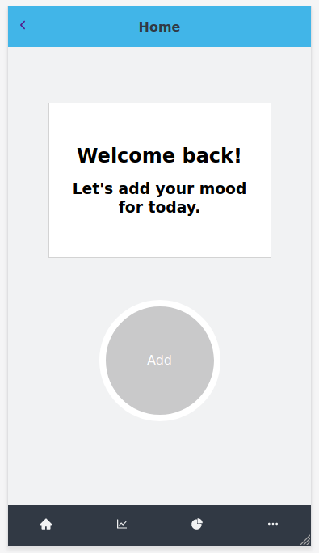
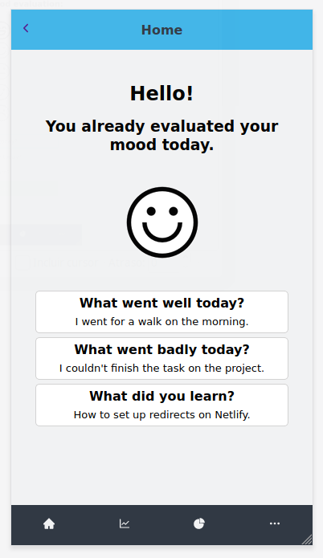
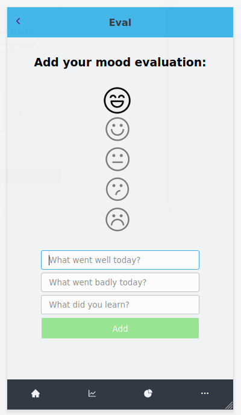
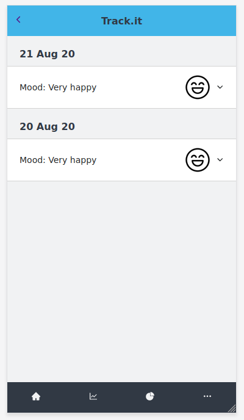

<h1 align="center">
  OhMyMood!
</h1>

<h4 align="center"><a href="https://ohmymood.herokuapp.com">Live version >></a></h4>

## Table of Contents

* [About the project](https://github.com/bruna-genz/mood-tracker-client#about-the-project)
* [About OhMyMood!](https://github.com/bruna-genz/mood-tracker-client#about-ohmymood!)
  * [Home](https://github.com/bruna-genz/mood-tracker-client#home)
  * [Mood evaluation form](https://github.com/bruna-genz/mood-tracker-client#mood-evaluation-form)
  * [Mood progress](https://github.com/bruna-genz/mood-tracker-client#mood-evaluations-list)
  * [Future features](https://github.com/bruna-genz/mood-tracker-client#future-features)
* [Built with](https://github.com/bruna-genz/mood-tracker-client#built-with)
* [Installation](https://github.com/bruna-genz/mood-tracker-client#installation)
* [Testing](https://github.com/bruna-genz/mood-tracker-client#testing)
* [Author](https://github.com/bruna-genz/mood-tracker-client#author)
* [Acknowledgments](https://github.com/bruna-genz/mood-tracker-client#acknowlegdemnts)

## About the project

This project is the Final Capstone from the Microverse Technical Curriculum. Its purpose was to create a real-world-like project, built with business specifications, based on a tracking mobile application. 

The front-end was built with React, using Redux to manage the internal state. For the back-end I used Ruby on Rails, its repository can be found [here](https://github.com/bruna-genz/mood-tracker-api).

The project's original instructions can be found [here](https://www.notion.so/Catalogue-of-Statistics-72446e7fa33c403a9b6a0bc1de5c6cf5).

## About OhMyMood!

OhMyMood! is a mobile application to track moods and emotions. According to studies, understanding your moods is helpful to manage them and feel better fast. If a person is more aware of their mood, they may better manage their lifestyles choices, make more informed decisions, prevent or avoid triggers of negative moods, resulting in a better quality of life.

To use OhMyMood!, we require the user to sign up or log in. Every day, they can evaluate their mood with 5 different levels, represented by emojis. Also, they will have three questions to answer to better evaluate their emotions: “What went well today?”, “What went badly?”, and “What did your learn?”. On the progress page, the user can check and compare the mood evaluations from the past.

### Home

The home page has two states: if the user hasn't evaluate their mood that they, it will display a button for the evaluation form (first image). Otherwise, it will show the mood evaluation for that day (second image).

### Mood evaluation form

To evaluate their mood, the user selects the emoji that represents their current mood: Very happy, happy, normal, sad, and very sad. Also, they should answer the three questions, which will provide a better understanding of emotions and triggers.

### Mood progress

In the evaluations list, all the user can see all recorded moods. This way, they can compare them and see the mood progress. By clicking in one of the recorded moods, it will show a list of the remaining answers for that day.

### Future features

- Design for larger screens.
- Possibility to edit current day mood.
- Statistics page, which will show more details about mood progression.
- More features to the menu page: edit user information, profile image. 

## Built With

- HTML5; 
- CSS3;
- JavaScript;
- React;
- Redux;
- Webpack;
- Heroku.

## Installation

To install a local version of this app, download or clone the project [here](https://github.com/bruna-genz/mood-tracker-client.git), then navigate to the project's directory from the terminal and run the following commands:
- `npm i`
- `npm start`

## Author

:woman: **Bruna Genz**

- Github: [@bruna-genz](https://github.com/bruna-genz)
- Twitter: [@Bruna_GK](https://twitter.com/Bruna_GK)
- Linkedin: [Bruna Genz](https://www.linkedin.com/in/brunagenz/)
- Email: brunagenz92@gmail.com

## Acknowledgments

- [Gregoire Vella on Behance](https://www.behance.net/gregoirevella) for the design idea.
- [Alejandro Sabogal](https://medium.com/@asabogal) for the amazing tutorial about React and Rails user authentication.
- [Microverse](https://www.microverse.org/) team, for being the guide on this exciting and exhaustive journey.
